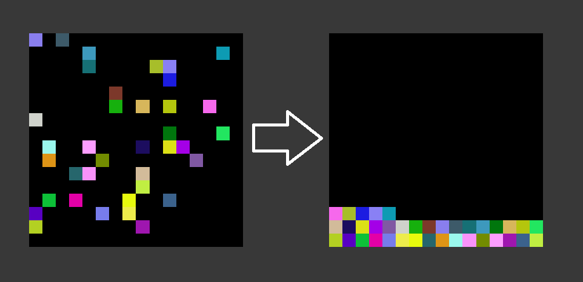
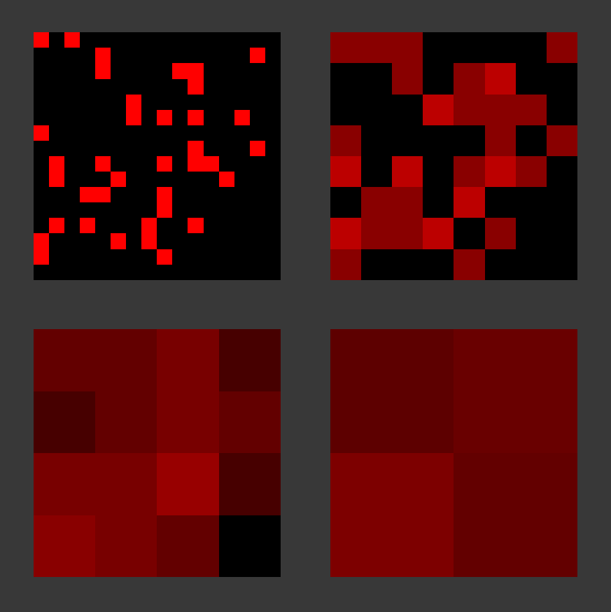
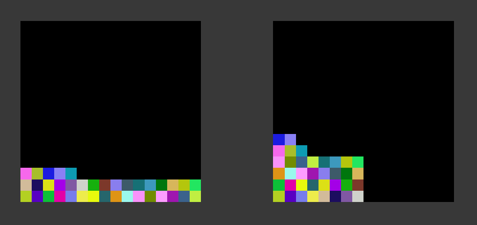

# Compact Sparse Texture Demo

This little demo shows how to compact sparse textures.

The first step is to create a RFloat render texture with auto mipmap generation enabled and the same dimensions as your sparse texture.  
Then you write a value of 1.0 for any active pixel in the sparse texture and 0.0 for all inactive pixels. The auto generated mipmaps are essentially a quad tree that counts how many pixels are active. Instead of a count it has averages so we need to multiply by `exp2(mipLevel * 2)` to get the count in each node.

With that we can make an algorithm to find the nth active pixel. We start at the maxMipLevel - 1 and work our way down. In each level we check 3 pixels. We can skip the 4th pixel check since we know that we have to be in there if we weren't in the first 3. The order is bottom left, bottom right, top left & finally top right.  
This traversal is equivalent to the [ZOrder curve](https://en.wikipedia.org/wiki/Z-order_curve). Therefore if we want a stable output order our 1D index has to be the ZOrder curve instead of the straight forward row by row traversal.

